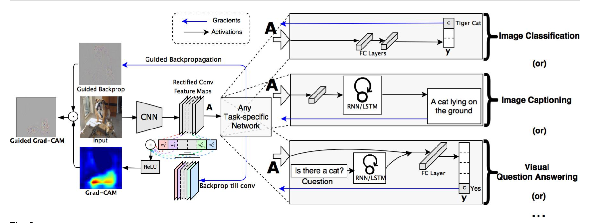

# Grad-CAM-Pytorch-Implementation

## Description

This is based on the thesis Grad-CAM:Visual Explanations for Deep Networks via Gradient-based Localization. 

### 1. Introduction 

Convolutional Neural Networks enabled groundbreaking breakthroughs in various computer vision tasks. Although promising, CNNs lack decompos- ability into individually intuitive components. In other words, it is so hard to interpret that we humans have little or no information for why they fail when they fail, and why they succeed whey they succeed. This thesis fo- cuses on how to make this CNNs interpretable, by implementing a concept called Grad-CAM. This will not only build more trust between AI and hu- mans, but also teach humans how to make better decisions.

Previously, a number of attempts have been made to interpret CNNs, such as Guided Backpropagation and Deconvolution methods. More re- cently, Class Activation Mapping (CAM) method has been used which removes the final FC layers. Although somewhat similar to CAM method, Grad-CAM is an upgrade from CAM, for it can produce better results even without altering a single layer from the original CNN architecture. This research explains how Grad-CAM is done, and applies and evaluates this method through various tasks, such as classification, captioning, and VQA models.

### 2. Grad-CAM

It is proven that deeper layers of CNNs generally capture higher-level visual constructs. Therefore, Grad-CAM utilizes the very last layer before the FC layers, for it is believed to contain the best spatial information. To obtain the class-discriminative localization map, Lc ∈ Ruxv, first the gradient Grad−CAM of score class c, yc with respect to feature map activations Ak is computed. This is then global-average-pooled over width/height. 

## Results
Grad-CAM output results for four different classes in ImageNet. 

    

    
    

    
    

    
    

